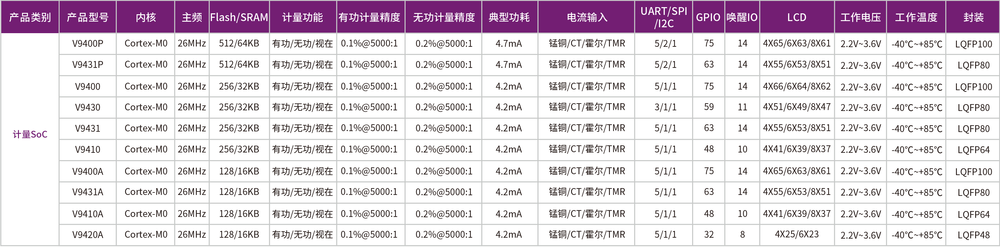

# [V9400](https://doc.soc.xin/V9400)

* [Vango](http://www.vangotech.com): [Cortex-M0](https://github.com/SoCXin/Cortex)
* [L1R3](https://github.com/SoCXin/Level): 26 MHz

## [简介](https://github.com/SoCXin/V9400/wiki)

[V94XX(A)](http://www.vangotech.com/pd.php?types=2&id=8)是高度集成的 32 位 SoC 系列产品，适合于多功能、低功耗的物联网应用。它集成了 Cortex-M0 核，主频最高26MHz，128/256/512KB FLASH，16/32/64KB SRAM，支持有功、无功、视在三种模式的全波和基波能量计量，支持UART/SPI/I2C 接口，LCD，WDT，RTC 和电能计量模块。

V94XX(A)内置一个电能计量模块，支持多种模式的全波和基波能量计量，并支持监测多种电网事件。同时，波形数据可通过 Px 以 SPI 协议传输出去，或者通过波形缓存存在本地。

### 关键参数

* 26 MHz Cortex-M0
* 16/32/64KB SRAM
* 128/256/512KB FLASH
* 支持S级电能质量分析
* 支持过流、过压、欠流、欠压、电压骤升、电压骤降检测
* 最快10ms的电压/电流快速检测
* 支持直流计量
* 波形录制和缓存可用于谐波分析的场景，支持最高64次谐波分析
* 工作电压：2.2V-3.6V，其中 ADC 部分和计量部分支持的工作电压范围：2.6V~3.6V
*  工作温度：-40℃~+85℃
*  储存温度：-55℃~+150℃
*  正常模式：4.2mA@6.5536MHz(V94XX/V94XXA)
*  正常模式：4.7mA@6.5536MHz(V94XXP)
*  IDLE模式：0.379mA@6.5536MHz
*  浅睡眠模式(LCD开启)：9.3μA (V94XX/V94XXA)
*  浅睡眠模式(LCD开启)：12μA (V94XXP)
*  浅睡眠模式(LCD关闭)：3.1μA
*  深睡眠模式：2.9 μA
*  最多 5 个 UART 控制器，具有奇偶校验功能
*  每个串口发送通道可以配置带红外载波以进行红外传输
*  最多 1 个 ISO7816 控制器
*  最多 1 个 SPI 控制器（主/从机制）
*  最多 1 个 I2C 控制器（主/从机制）
*  4 个 32 位定时器
*  4 个 16 位 PWM 定时器
*  4 通道 DMA 控制器
*  128/192/256 位 AES 编解码器
*  ECC 加速算法引擎
*  双帧缓存 LCD 控制器
*  4COM/6COM/8COM
*  1/3 或 1/4 偏置
*  支持多类型的扫描频率
*  LCD 电压：默认输出电压是 3.3V 左右，2.7~3.6V 可调节，调节步长是 0.06V
*  周期可编程的看门狗定时器
*  支持多唤醒源
*  最多 75 个 GPIO
*  最多 14 个 GPIO 外部中断唤醒口
*  16 位 ADC，具有 10 Ksps 及最多 9 个外部输入
*  ADC 支持手动采样模式或自动采样模式
*  2 路比较器，单端输入或差分输入
*  内置 32KHz 及 6.5 MHz RC 时钟
*  内置 2 个 PLL
*  支持外部 32.768 KHz 晶体或 6.5536 MHz 晶体（可选）
*  内置 32.768 KHz 和 6.5536 MHz 晶体的监测电路
*  每个时钟都可选做为系统时钟
*  支持数字时钟分频器，最高可达 1/256
*  支持可编程的低电压监测
*  支持 DVCC1 的上电复位
*  支持电压监测
*  支持 RTC 1 ppm 级别的手动校正
* 3路独立的过采样∑/∆ ADC：1 路电压；1 路 A 通道电流；另外 1 路 B 通道电流
    * 满足 IEC 62053-21:2020/ IEC 62053-22:2020 和 IEC 62053-23:2020 的要求
    * 5000:1 动态范围内，全波/基波有功能量计量误差小于 0.1%
    * 5000:1 动态范围内，全波/基波无功能量计量误差小于 0.2%
    * 5000:1 动态范围内，全波/基波电压/电流有效值误差小于 0.5%
* 提供各种测量数据：
    * 电压/电流信号直流分量
    * 全波/基波电压/电流有效值瞬时值/平均值
    * 全波/基波有功/无功功率瞬时值/平均值
    * 全波 10 或 12 周波有效值
    * 全波视在功率瞬时值/平均值
    * 正向/反向能量，有功/无功/视在功率/电流有效值/常数值/基波通道可选
    * 频率和相位
    * 支持软件校表
    * 支持小信号加速校表
    * 电流输入：支持锰铜、CT、霍尔及 TMR

## [资源收录](https://github.com/SoCXin)

* [参考资源](src/)
* [参考文档](docs/)
* [参考工程](project/)

## [选型建议](https://github.com/SoCXin/V9400)

[V9400](https://github.com/SoCXin/V9400)系列主要应用于海外智能电表、防窃电表、三锰铜表、光伏导轨表、智能断路器、充电桩等。

## [www.SoC.xin](http://www.SoC.Xin)
